<p align="center">
  
</p>

<p align="center">
  <b>Modern eDNA metabarcoding</b> &mdash; from raw FASTQ to GBIF-ready biodiversity tables.
</p>

<p align="center">
  <a href="https://www.python.org/downloads/"></a>
  <a href="LICENSE"></a>
  
  
</p>

<p align="center">
  <a href="#-quick-start">Quick start</a> &nbsp;·&nbsp;
  <a href="#-pipeline">Pipeline</a> &nbsp;·&nbsp;
  <a href="#-configuration">Configuration</a> &nbsp;·&nbsp;
  <a href="#-cli-commands">CLI</a> &nbsp;·&nbsp;
  <a href="#-outputs">Outputs</a> &nbsp;·&nbsp;
  <a href="#-documentation">Docs</a>
</p>


## 🧬 What is SeeDNAP?

SeeDNAP turns raw paired-end FASTQ files into taxonomically assigned feature tables, ready for biodiversity analysis or **GBIF** submission. Every step's status is tracked in a per-run state file, so a failed run resumes from exactly where it stopped.

A **feature** is a candidate sequence variant with a per-sample read count. SeeDNAP gives you two ways to derive them &mdash; pick one path per run:

- 🟢 **OTUs** &mdash; sequences clustered at a similarity threshold (**SWARM**)
- 🟢 **ASVs** &mdash; exact sequences resolved by denoising (**DADA2**)

```mermaid
flowchart LR
    raw[Raw FASTQ<br/>R1 / R2]:::io
    trim[Trim<br/>Cutadapt 2-pass]:::pass

    subgraph s2 [STEP 2 · Cluster — pick one]
        direction TB
        swarm[SWARM<br/>VSEARCH + SWARM]:::reco
        dada2[DADA2<br/>R / Bioconductor]:::alt
    end

    subgraph s3 [STEP 3 · Taxonomy — pick one]
        direction TB
        blast[BLAST + LCA<br/>default]:::reco
        rdp[DADA2 RDP]:::alt
        decipher[DECIPHER]:::alt
        ecotag[ecotag]:::alt
    end

    export[Export<br/>GBIF / DarwinCore]:::pass
    final[Final CSV<br/>Taxonomy + Abundances]:::io
    report[Run report<br/>read tracking + HTML]:::pass

    raw --> trim --> s2 --> s3 --> export --> final
    final --> report

    classDef io fill:#0D1117,stroke:#00C853,stroke-width:1.5px,color:#e6edf3
    classDef pass fill:#00C853,stroke:#0D1117,stroke-width:1.5px,color:#0D1117
    classDef reco fill:#00C853,stroke:#0D1117,stroke-width:2px,color:#0D1117
    classDef alt fill:#161B22,stroke:#2EA043,stroke-width:1.5px,color:#c9d1d9
```



## ⚡ Quick start

> [!IMPORTANT]
> **On the ETH eDNA server, SeeDNAP is already installed and always current** &mdash; a shared conda env at `/home/shared/edna/envs/seednap`. Don't clone it, don't `pip install`, and don't keep a per-dataset copy (a private clone only goes stale). All you provide per dataset is a **config file**; each run writes everything into the **output folder named in that config**.

```bash
# 1 · activate the shared env (use the full path)
conda activate /home/shared/edna/envs/seednap

# 2 · copy the closest marker template, then set three paths in it
cp /home/shared/edna/seednap/config/markers/teleo.yaml ~/my_run.yaml
#     paths.raw_data → your FASTQ directory  (per-sample R1/R2; per-library subfolders are fine)
#     paths.output   → results folder, created if missing  (e.g. ~/teleo_run)
#     paths.logs     → run-log location      (e.g. ~/teleo_run/logs)

# 3 · validate (checks paths + database exist), then run
seednap validate ~/my_run.yaml
seednap run-pipeline ~/my_run.yaml
```

Primers, database and steps are already correct per marker, so you usually touch nothing else. Everything lands under `paths.output`, so all you keep per dataset is your config and its output folder.

<details>
<summary><b>Installing elsewhere (local / dev setup)</b></summary>

```bash
git clone https://github.com/WildinSync/wis_seednap.git
cd wis_seednap
conda env create -f environment.yml
conda activate seednap
pip install -e .

# create a config, then point it at your data + a reference database
seednap init --marker teleo --output config/markers/my_marker.yaml
#   paths.raw_data              → a directory of paired-end FASTQ files
#   taxonomy.databases.<method> → a reference database for the chosen method
# a fresh config references neither, so the run fails preflight until both exist

seednap validate config/markers/my_marker.yaml
seednap run-pipeline config/markers/my_marker.yaml
```
</details>

> [!TIP]
> If a run fails partway, fix the cause and re-run with `--resume` to skip completed steps. Decode any error code with `seednap explain <code>`.

## 🔬 Pipeline

| # | Step | Tool | What it does |
|:--:|---|---|---|
| – | Demultiplex <sub>opt</sub> | built-in | Ligation-tag demultiplexing (only when `demultiplex` is in `pipeline.steps`; omit for pre-demultiplexed inputs) |
| **1** | **Trim** | Cutadapt | Two-pass primer removal (5′ then 3′) |
| **2** | **Cluster** | SWARM **or** DADA2 | OTUs (clustered) or ASVs (denoised) &mdash; both also remove PCR chimeras |
| **3** | **Taxonomy** | BLAST · DADA2 · DECIPHER · ecotag | Assign a taxon per feature; BLAST+LCA (default) reports the rank the data support |
| – | Decontaminate <sub>opt</sub> | built-in | Flag or subtract features seen in negative controls |
| **4** | **Export** | built-in | GBIF long-format table (one row per feature × sample) |
| – | DarwinCore <sub>opt</sub> | built-in | GBIF-ready occurrence CSV + a dropped-rows QA report |
| **5** | **Report** | built-in | Per-step read tracking, data-loss warnings, HTML run report |

Each stage runs **only if listed in `pipeline.steps`** &mdash; the single ordered source of truth, validated against stage dependencies at config load.

> [!WARNING]
> Only the `ligation` demultiplexing protocol is implemented; listing `demultiplex` with any other protocol is rejected at config load. If your reads are already demultiplexed, just leave `demultiplex` out of `pipeline.steps`.

<details>
<summary><b>Step ordering, decontamination & contaminant flags — details</b></summary>

- **Ordering rules (validated at load):** `demultiplex` → `trim` → a feature step (`dada2` **or** `swarm`, mutually exclusive) → `taxonomy` → `clean` → `export`. `clean` runs before `export` so the export uses the decontaminated table.
- **`clean` step (presence-based, feature-level):** any feature with ≥1 read in an applicable negative control is treated as contamination. An **extraction blank** cleans only samples sharing its `extraction_ID`; a **PCR blank** cleans the whole dataset. `cleaning.mode` is `flag` (default, annotate only) or `subtract` (zero those reads — irreversible, opt-in). Driven by the FAIRe manifest; runs only when `clean` is in `pipeline.steps`.
- **`taxonomy.contaminants`:** a separate list of species names flagged in the export `contamination_flag` column. Empty by default. Distinct from the manifest-driven `clean` step.
- **DADA2 per-library:** `dada2.per_library` learns the error model per sequencing library; the grouping comes from the metadata `seq_run_id`, or is derived from per-library subfolders of `raw_data` when no metadata is given.

</details>

## ⚙️ Configuration

One YAML file per marker controls everything. Example configs live in [config/markers/](config/markers/).

```yaml
marker:
  name: "teleo"
  primers:
    forward: "ACACCGCCCGTCACTCT"
    reverse: "CTTCCGGTACACTTACCATG"

paths:
  raw_data: "/path/to/fastq/files"
  output: "outputs"

pipeline:
  steps: ["trim", "swarm", "taxonomy", "report"]   # use "dada2" instead of "swarm" for the ASV path
```

📖 Full reference: **[docs/configuration.md](docs/configuration.md)**

## ⌨️ CLI commands

| Command | Description |
|---|---|
| `run-pipeline CONFIG` | Run the full pipeline from a YAML config |
| `init` | Generate an example config file |
| `validate CONFIG` | Schema check **+ preflight** (fails if referenced files / databases are missing) |
| `trim INPUT_DIR` | Primer trimming with Cutadapt |
| `swarm MARKER READS_DIR` | SWARM OTU clustering |
| `dada2 MARKER READS_DIR` | DADA2 ASV processing |
| `blast QUERY REF COUNTS` | BLAST taxonomic assignment with LCA |
| `assign-taxonomy METHOD MARKER QUERY COUNTS` | Generic taxonomy (blast / dada2 / decipher / ecotag) |
| `format-gbif INPUT` | Convert results to GBIF long format |
| `create-gbif TAXO SAMPLE_META PROJECT_META OUTPUT` | Build the DarwinCore occurrence CSV |
| `wis-metadata --marker M --output-dir DIR …` | Generate the export's metadata CSVs from the WIS database <sub>(needs `pip install 'seednap[wis]'`)</sub> |
| `demultiplex READS LIB META` | Demultiplex ligation-based libraries |
| `manifest FIELD_META` | Build a canonical FAIRe sample manifest from lab CSVs |
| `clean ABUNDANCE FIELD_META OUTPUT` | Decontaminate an abundance table against its controls |
| `report MARKER` | Build the read-tracking report (`--html` for the visual report) |
| `monitor MARKER` | Summarise a run from its state JSON |
| `explain [CODE]` | Explain a seednap error code (no arg → list all) |
| `version` | Print the installed version |

Run `seednap <command> --help` for full options.

<details>
<summary><b>Metadata-join &amp; preflight notes</b></summary>

- **`validate` / `run-pipeline` preflight** fails fast if raw data or reference databases are missing on disk, or the taxonomy database block is unresolved &mdash; before any compute.
- **`create-gbif`** joins taxonomy to your sample metadata on `eventID`, normalizing dot/dash/underscore separators (so `DAR-2023-0025` matches a `make.names()`-dotted `DAR.2023.0025`). A **zero-match** join raises rather than emitting blank dates/coordinates; a partial match warns with the unmatched IDs.
- **`wis-metadata`** pulls each sample's `eventID`, date, coordinates (PostGIS point), environmental medium and size from the WIS database into the two CSVs the export consumes &mdash; see [docs/gbif-export.md](docs/gbif-export.md#sourcing-metadata-from-the-wis-database).

</details>

## 📂 Outputs

Per-step artifacts go under `<paths.output>/<NN_step>/<marker>/` (`01_trim`, `02_swarm`/`02_dada2`, `03_taxo`, `04_report`). The final tables land at the output root:

| File | Contents |
|---|---|
| `<marker>_<method>.csv` | Merged taxonomy + abundance table (e.g. `teleo_blast.csv`, `teleo_dada2RDP.csv`) |
| `<marker>_<method>_gbif.csv` | GBIF long-format table (the `export` step) |
| `<marker>_<method>_darwincore.csv` | GBIF-ready DarwinCore occurrence file (`darwincore` step) |
| `<marker>_<method>_darwincore_dropped.csv` | Occurrences removed (control / non-target), with the reason |

The `<method>` token follows `taxonomy.method` (the DADA2 taxonomy table uses `dada2RDP`). Run state lives at `<paths.output>/.<marker>_state.json`.

<details>
<summary><b>Reproducibility — every run rebuilds from its own outputs</b></summary>

At the start of each run the orchestrator writes the full effective config (your YAML merged over the defaults) to `<paths.output>/.<marker>_config.snapshot.yaml`, and stamps the producing SeeDNAP version into the state JSON. On `--resume`, a version mismatch is surfaced as a `[WARN]`, so a result is never silently stitched across incompatible versions. For a worked example of a finished run, see [docs/example-outputs/](docs/example-outputs/).

</details>

## 📊 Reporting

The `report` step is on by default, so every run reports on itself &mdash; writing to `<paths.output>/04_report/<marker>/`:

```
read_tracking.csv / .txt    reads & sequences surviving each step, per sample
step_summary.csv            run totals: reads + ASVs/OTUs after each step
report.html                 self-contained visual report (no JS, no CDN)
```

Read tracking records reads in/out of every step plus `pct_retained`, and raises data-loss warnings against `report.warn_below_retention_pct` (default 30) and `report.warn_step_loss_pct` (default 70). A count that cannot be measured is written as `NA` with a `[WARN]`, never a misleading `0`. Regenerate the report from an existing run any time (never re-runs the pipeline):

```bash
seednap report teleo --html --field-metadata metadata_field_my_dataset.csv
```

📖 Full detail: **[docs/reporting.md](docs/reporting.md)**

## 🛠️ Requirements

| Tool | Version | Purpose |
|---|:--:|---|
| Python | 3.9 | Pipeline runtime |
| Cutadapt | 5.2 | Primer trimming |
| VSEARCH | 2.30.5 | Merging, dereplication, chimera detection |
| SWARM | 3.1.6 | OTU clustering |
| BLAST+ | 2.17.0 | Taxonomic assignment |
| R | 4.2 | DADA2 / DECIPHER (optional) |

Versions are pinned in `environment.yml`. OBITools (for the optional `ecotag` method) lives in a separate env &mdash; see [docs/ecotag-setup.md](docs/ecotag-setup.md).

## 📖 Documentation

| Guide | What's inside |
|---|---|
| [installation.md](docs/installation.md) | Installation and environment setup |
| [configuration.md](docs/configuration.md) | Complete YAML configuration reference |
| [pipeline-steps.md](docs/pipeline-steps.md) | Detailed description of each step |
| [cli-reference.md](docs/cli-reference.md) | Full CLI command reference |
| [taxonomy-methods.md](docs/taxonomy-methods.md) | Taxonomy methods compared |
| [gbif-export.md](docs/gbif-export.md) | GBIF and DarwinCore export guide |
| [reporting.md](docs/reporting.md) | Read tracking, warnings, and the HTML report |
| [ecotag-setup.md](docs/ecotag-setup.md) | OBITools / ecotag installation |

<details>
<summary><b>Project structure</b></summary>

```
seednap/
  src/seednap/
    cli.py                  # CLI entry point
    config/                 # Pydantic config models + YAML loader + FAIRe manifest
    pipeline/               # Orchestrator + run-state management
    steps/
      trimming/             # Cutadapt integration
      dada2/                # DADA2 R wrapper
      swarm/                # VSEARCH + SWARM clustering
      taxonomic_assignment/ # BLAST, DADA2, DECIPHER, ecotag
      cleaning/             # Control decontamination ('clean' step)
      formatting/           # GBIF + DarwinCore export
      report/               # Read-tracking table + HTML run report
    errors/                 # Error codes + 'explain' / preflight machinery
    utils/                  # Subprocess, logging, sequence tools
    scripts/                # Bundled R scripts (DADA2, DECIPHER)
    data/templates/         # Bundled CSV templates (primers, GBIF)
  config/markers/           # Example YAML configs
```
</details>


## 🙏 Acknowledgments

SeeDNAP builds on [Cutadapt](https://cutadapt.readthedocs.io/) (Martin, 2011), [VSEARCH](https://github.com/torognes/vsearch) (Rognes et al., 2016), [SWARM](https://github.com/torognes/swarm) (Mahé et al., 2015), [BLAST+](https://blast.ncbi.nlm.nih.gov/) (Camacho et al., 2009), and [DADA2](https://benjjneb.github.io/dada2/) (Callahan et al., 2016).

## 📜 License

MIT &mdash; see [LICENSE](LICENSE).
