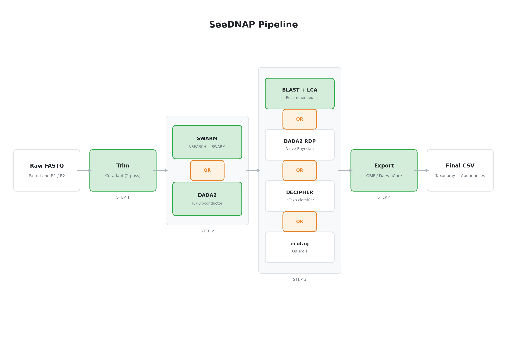

<p align="center">
  
</p>

**Modern eDNA metabarcoding pipeline with DADA2 and SWARM**

[](https://www.python.org/downloads/)
[](LICENSE)

---

## What is SeeDNAP?

SeeDNAP is an end-to-end Python pipeline for processing environmental DNA (eDNA) metabarcoding data. It takes raw paired-end FASTQ files and produces taxonomically assigned OTU/ASV tables ready for biodiversity analysis or GBIF submission.

<p align="center">
  
</p>

## Quick Start

```bash
# Install
git clone https://gitlab.ethz.ch/ele-projects/edna/edna-app/seednap.git
cd seednap
conda env create -f environment.yml
conda activate seednap
pip install -e .

# Create and edit a config
seednap init --marker teleo --output config/markers/my_marker.yaml

# Run the pipeline
seednap run-pipeline config/markers/my_marker.yaml
```

That's it. See [docs/](docs/) for configuration details, step-by-step guides, and CLI reference.

## Requirements

| Tool | Version | Purpose |
|---|---|---|
| Python | >= 3.9 | Pipeline runtime |
| Cutadapt | >= 4.0 | Primer trimming |
| VSEARCH | >= 2.0 | Read merging, dereplication, chimera detection |
| SWARM | >= 3.0 | OTU clustering |
| BLAST+ | >= 2.12 | Taxonomic assignment |
| R | >= 4.0 | DADA2 / DECIPHER (optional) |

All tools are included in `environment.yml`.

## Pipeline Steps

| Step | Tool | Description |
|---|---|---|
| **Trim** | Cutadapt | Two-pass primer removal (5' then 3') |
| **Cluster** | SWARM or DADA2 | OTU clustering or ASV denoising |
| **Taxonomy** | BLAST, DADA2, DECIPHER, or ecotag | Taxonomic assignment with LCA resolution |
| **Export** | Built-in | GBIF-compatible and DarwinCore output |

## CLI Commands

| Command | Description |
|---|---|
| `run-pipeline CONFIG` | Run the full pipeline from a YAML config |
| `init` | Generate an example config file |
| `validate CONFIG` | Validate a config file |
| `trim INPUT_DIR` | Primer trimming with Cutadapt |
| `swarm MARKER READS_DIR` | SWARM OTU clustering |
| `dada2 MARKER READS_DIR` | DADA2 ASV processing |
| `blast QUERY REF COUNTS` | BLAST taxonomic assignment with LCA |
| `assign-taxonomy METHOD MARKER QUERY COUNTS` | Generic taxonomy (blast/dada2/decipher/ecotag) |
| `format-gbif INPUT` | Convert results to GBIF long format |
| `create-gbif TAXO SAMPLE_META PROJECT_META OUTPUT` | Build DarwinCore GBIF occurrence CSV |
| `demultiplex READS LIB META` | Demultiplex ligation-based libraries |

Run `seednap --help` or `seednap <command> --help` for full options.

## Configuration

Everything is controlled by a single YAML file per marker. Example configs are in [config/markers/](config/markers/). Key sections:

```yaml
marker:
  name: "teleo"
  primers:
    forward: "ACACCGCCCGTCACTCT"
    reverse: "CTTCCGGTACACTTACCATG"

paths:
  raw_data: "/path/to/fastq/files"
  output: "outputs"

pipeline:
  steps: ["trim", "swarm", "taxonomy"]
```

Full configuration reference: [docs/configuration.md](docs/configuration.md)

## Documentation

| Document | Description |
|---|---|
| [docs/installation.md](docs/installation.md) | Installation and environment setup |
| [docs/configuration.md](docs/configuration.md) | Complete YAML configuration reference |
| [docs/pipeline-steps.md](docs/pipeline-steps.md) | Detailed description of each pipeline step |
| [docs/cli-reference.md](docs/cli-reference.md) | Full CLI command reference |
| [docs/taxonomy-methods.md](docs/taxonomy-methods.md) | Taxonomy assignment methods comparison |
| [docs/gbif-export.md](docs/gbif-export.md) | GBIF and DarwinCore export guide |

## Project Structure

```
seednap/
  src/seednap/
    cli.py                          # CLI entry point
    config/                         # Pydantic config models + YAML loader
    pipeline/                       # Orchestrator + state management
    steps/
      trimming/                     # Cutadapt integration
      dada2/                        # DADA2 R wrapper
      swarm/                        # VSEARCH + SWARM clustering
      taxonomic_assignment/         # BLAST, DADA2, DECIPHER, ecotag
      formatting/                   # GBIF + DarwinCore export
    utils/                          # Subprocess, logging, sequence tools
  config/markers/                   # Example YAML configs
  scripts/                          # R scripts (DADA2, DECIPHER)
```

## Acknowledgments

SeeDNAP builds on: [Cutadapt](https://cutadapt.readthedocs.io/) (Martin, 2011), [VSEARCH](https://github.com/torognes/vsearch) (Rognes et al., 2016), [SWARM](https://github.com/torognes/swarm) (Mahe et al., 2015), [BLAST+](https://blast.ncbi.nlm.nih.gov/) (Camacho et al., 2009), [DADA2](https://benjjneb.github.io/dada2/) (Callahan et al., 2016).

## License

MIT. See [LICENSE](LICENSE).
