<p align="center">
  
</p>

**Modern eDNA metabarcoding pipeline with DADA2 and SWARM**

[](https://www.python.org/downloads/)
[](LICENSE)

---

## What is SeeDNAP?

SeeDNAP is an end-to-end Python pipeline for processing environmental DNA (eDNA) metabarcoding data. It takes raw paired-end FASTQ files and produces taxonomically assigned OTU/ASV tables ready for biodiversity analysis or GBIF submission. Every step's status is recorded in a per-run state JSON, so a failed run can be resumed from the step that failed.

```mermaid
flowchart LR
    raw[Raw FASTQ<br/>Paired-end R1 / R2]:::io
    trim[Trim<br/>Cutadapt 2-pass]:::pass

    subgraph s2 [STEP 2 : Cluster - pick one]
        direction TB
        swarm[SWARM<br/>VSEARCH + SWARM]:::recommended
        dada2[DADA2<br/>R / Bioconductor]:::alt
    end

    subgraph s3 [STEP 3 : Taxonomy - pick one]
        direction TB
        blast[BLAST + LCA<br/>Recommended]:::recommended
        rdp[DADA2 RDP<br/>Naive Bayesian]:::alt
        decipher[DECIPHER<br/>IdTaxa classifier]:::alt
        ecotag[ecotag<br/>OBITools]:::alt
    end

    export[Export<br/>GBIF / DarwinCore]:::pass
    final[Final CSV<br/>Taxonomy + Abundances]:::io
    report[Run report<br/>read tracking + HTML]:::pass

    raw --> trim --> s2 --> s3 --> export --> final
    final --> report

    classDef io fill:#ffffff,stroke:#bbbbbb,stroke-width:1px,color:#000
    classDef pass fill:#d4edda,stroke:#28a745,stroke-width:2px,color:#000
    classDef recommended fill:#d4edda,stroke:#28a745,stroke-width:2px,color:#000
    classDef alt fill:#ffffff,stroke:#bbbbbb,stroke-width:1px,color:#000
```



## Quick Start

> [!IMPORTANT]
> **On the ETH eDNA server, SeeDNAP is already installed.** A shared conda env lives at
> `/home/shared/edna/envs/seednap` and every user can use it, so you do **not** need to create
> an environment or `pip install` anything. Just activate it and go:
> ```bash
> conda activate /home/shared/edna/envs/seednap
> seednap run-pipeline config/markers/my_marker.yaml
> ```
> The install steps below are only for a fresh setup elsewhere (e.g. local development).

```bash
# Install (fresh setup only; not needed on the eDNA server, see above)
git clone https://github.com/WildinSync/wis_seednap.git
cd wis_seednap
conda env create -f environment.yml
conda activate seednap
pip install -e .

# Create and edit a config (--minimal, the default, emits only required fields;
# --full emits the annotated reference template)
seednap init --marker teleo --output config/markers/my_marker.yaml

# Run the pipeline
seednap run-pipeline config/markers/my_marker.yaml
```

That's it. See [docs/](docs/) for configuration details, step-by-step guides, and CLI reference.

> [!TIP]
> If a run fails partway, fix the cause and re-run with `seednap run-pipeline config.yaml --resume`
> to skip completed steps (it reads the state JSON at `outputs/.<marker>_state.json`). Decode any
> error code with `seednap explain <code>`.

## Requirements

| Tool | Pinned Version | Purpose |
|---|---|---|
| Python | 3.9 | Pipeline runtime |
| Cutadapt | 5.2 | Primer trimming |
| VSEARCH | 2.30.5 | Read merging, dereplication, chimera detection |
| SWARM | 3.1.6 | OTU clustering |
| BLAST+ | 2.17.0 | Taxonomic assignment |
| R | 4.2 | DADA2 / DECIPHER (optional) |

External tool versions are pinned in `environment.yml` to the set we validate against. OBITools (for the optional `ecotag` method) lives in a separate env -- see [docs/ecotag-setup.md](docs/ecotag-setup.md).

## Pipeline Steps

| Step | Tool | Description |
|---|---|---|
| **Demultiplex** *(optional)* | Built-in | Ligation-tag demultiplexing; list `demultiplex` in `pipeline.steps` to run it, omit it for pre-demultiplexed inputs. Aborts if more than `demultiplex.max_sample_failure_rate` (default 0.5) of samples fail. |
| **Trim** | Cutadapt | Two-pass primer removal (5' then 3') |
| **Cluster** | SWARM or DADA2 | OTU clustering or ASV denoising. DADA2 can learn error models per sequencing library, then merge, via `dada2.per_library`. |
| **Taxonomy** | BLAST, DADA2, DECIPHER, or ecotag | Taxonomic assignment. BLAST (default) supports `lca_algorithm: cascade` or `collapsed_taxonomy`; DADA2 uses RDP bootstrap. See [docs/taxonomy-methods.md](docs/taxonomy-methods.md). |
| **Decontaminate** *(optional)* | Built-in | Flag or subtract reads found in negative controls, identified from the FAIRe manifest (add `clean` to `pipeline.steps`). |
| **Export** | Built-in | GBIF long format and DarwinCore occurrence CSV with deterministic `occurrenceID` and `contamination_flag`. |
| **Report** | Built-in | Per-step read/sequence tracking table, data-loss warnings, and a self-contained HTML run report. Runs when `report` is in `pipeline.steps` (the default); `report.html_report: false` writes the tables only. |

> [!NOTE]
> Each stage runs only if listed in `pipeline.steps` (the single ordered source of truth). The list
> order is validated against stage dependencies at config load: `demultiplex` before `trim`; `dada2`
> or `swarm` before `taxonomy`/`clean`; `taxonomy` before `export`. `dada2` and `swarm` are mutually
> exclusive (keep exactly one).

> [!WARNING]
> Only the `ligation` demultiplexing protocol is implemented. Listing `demultiplex` in
> `pipeline.steps` with any other `demultiplex.protocol` (including the default `none`) is rejected
> at config load, before any step runs. If your reads are already demultiplexed, leave `demultiplex`
> out of `pipeline.steps`.

> [!IMPORTANT]
> `taxonomy.contaminants` is a list of species names (CRABS underscore format) flagged as candidate
> contaminants in the export `contamination_flag` column. It is empty by default, so nothing is
> flagged unless you populate it. This is distinct from the manifest-driven `clean` step, which acts
> on negative-control reads.

## CLI Commands

| Command | Description |
|---|---|
| `run-pipeline CONFIG` | Run the full pipeline from a YAML config |
| `init` | Generate an example config file |
| `validate CONFIG` | Validate a config file (schema check plus preflight: fails if referenced files are missing or the database block is unresolved) |
| `trim INPUT_DIR` | Primer trimming with Cutadapt |
| `swarm MARKER READS_DIR` | SWARM OTU clustering |
| `dada2 MARKER READS_DIR` | DADA2 ASV processing |
| `blast QUERY REF COUNTS` | BLAST taxonomic assignment with LCA |
| `assign-taxonomy METHOD MARKER QUERY COUNTS` | Generic taxonomy (blast/dada2/decipher/ecotag) |
| `format-gbif INPUT` | Convert results to GBIF long format |
| `create-gbif TAXO SAMPLE_META PROJECT_META OUTPUT` | Build DarwinCore GBIF occurrence CSV |
| `demultiplex READS LIB META` | Demultiplex ligation-based libraries |
| `manifest FIELD_META` | Build (and optionally validate) a canonical FAIRe sample manifest from lab CSVs |
| `clean ABUNDANCE FIELD_META OUTPUT` | Decontaminate an abundance table against its negative controls (flag or subtract) |
| `report MARKER` | Build the read-tracking report (+ `--html` for the visual run report) from existing outputs |
| `monitor MARKER` | Summarise a finished or in-progress run from its state JSON |
| `explain [CODE]` | Explain a seednap error code in depth; with no argument, list all codes |
| `version` | Print the installed SeeDNAP version |

Run `seednap --help` or `seednap <command> --help` for full options.

> [!NOTE]
> `seednap validate` is more than a schema check: it runs a preflight that fails if referenced
> files (raw data, reference databases) are missing on disk or the taxonomy database block is
> unresolved. `run-pipeline` runs the same preflight before any compute, so a syntactically valid
> config can still fail fast.

## Configuration

Everything is controlled by a single YAML file per marker. Example configs are in [config/markers/](config/markers/). Key sections:

```yaml
marker:
  name: "teleo"
  primers:
    forward: "ACACCGCCCGTCACTCT"
    reverse: "CTTCCGGTACACTTACCATG"

paths:
  raw_data: "/path/to/fastq/files"
  output: "outputs"

pipeline:
  steps: ["trim", "swarm", "taxonomy", "report"]   # a stage runs iff listed; use "dada2" instead of "swarm" for the ASV path
```

Full configuration reference: [docs/configuration.md](docs/configuration.md)

## Outputs

Per-step artifacts go under `<paths.output>/<NN_step>/<marker>/` (`01_trim`, `02_dada2` or
`02_swarm`, `03_taxo`, `04_report`). The two final tables land at the output root:

| File | Contents |
|---|---|
| `<paths.output>/<marker>_<method>.csv` | Merged taxonomy + abundance table (e.g. `teleo_blast.csv`, `teleo_dada2RDP.csv`) |
| `<paths.output>/<marker>_<method>_gbif.csv` | GBIF long-format / DarwinCore export |

The `<method>` token follows `taxonomy.method`, except the DADA2 taxonomy table uses `dada2RDP`.
Run state lives at `<paths.output>/.<marker>_state.json`.

## Reporting

The `report` step is in the default `pipeline.steps`, so every run reports on itself out of the box,
writing these artifacts to `<paths.output>/04_report/<marker>/`:

```
read_tracking.csv / .txt    reads & sequences surviving each step, per sample
step_summary.csv            run totals: reads + ASVs/OTUs after each step
report.html                 self-contained visual report (no JavaScript, no CDN), open in any browser
```

Read tracking records read pairs and sequences into and out of every step plus a `pct_retained`
column, and raises data-loss warnings against two thresholds: `report.warn_below_retention_pct`
(default 30) and `report.warn_step_loss_pct` (default 70). The HTML report adds QC charts, a
taxonomy headline, dataset provenance, and the colorized console log.

> [!IMPORTANT]
> A count that cannot be measured is written as `NA` with a `[WARN]`, never a misleading `0`, so
> "missing" and "genuinely zero" stay distinct.

Toggle the HTML with `report.html_report: false`, redirect with `report.output_dir`, and add
sampling provenance via `report.sample_metadata` / `report.project_metadata`. Regenerate the report
from an existing run at any time (this never re-runs the pipeline):

```bash
seednap report teleo --html --field-metadata metadata_field_my_dataset.csv
```

`seednap monitor <marker>` prints a quick text summary from the same run state. Full detail,
including the per-panel breakdown: [docs/reporting.md](docs/reporting.md).

## Documentation

| Document | Description |
|---|---|
| [docs/installation.md](docs/installation.md) | Installation and environment setup |
| [docs/configuration.md](docs/configuration.md) | Complete YAML configuration reference |
| [docs/pipeline-steps.md](docs/pipeline-steps.md) | Detailed description of each pipeline step |
| [docs/cli-reference.md](docs/cli-reference.md) | Full CLI command reference |
| [docs/taxonomy-methods.md](docs/taxonomy-methods.md) | Taxonomy assignment methods comparison |
| [docs/gbif-export.md](docs/gbif-export.md) | GBIF and DarwinCore export guide |
| [docs/reporting.md](docs/reporting.md) | Read-tracking table, data-loss warnings, and the HTML run report |
| [docs/ecotag-setup.md](docs/ecotag-setup.md) | OBITools / ecotag installation and discovery |

## Project Structure

```
seednap/
  src/seednap/
    cli.py                          # CLI entry point
    config/                         # Pydantic config models + YAML loader
    pipeline/                       # Orchestrator + state management
    steps/
      trimming/                     # Cutadapt integration
      dada2/                        # DADA2 R wrapper
      swarm/                        # VSEARCH + SWARM clustering
      taxonomic_assignment/         # BLAST, DADA2, DECIPHER, ecotag
      formatting/                   # GBIF + DarwinCore export
      report/                       # Read-tracking table + HTML run report
    utils/                          # Subprocess, logging, sequence tools
  config/markers/                   # Example YAML configs
  scripts/                          # R scripts (DADA2, DECIPHER)
```

## Acknowledgments

SeeDNAP builds on: [Cutadapt](https://cutadapt.readthedocs.io/) (Martin, 2011), [VSEARCH](https://github.com/torognes/vsearch) (Rognes et al., 2016), [SWARM](https://github.com/torognes/swarm) (Mahe et al., 2015), [BLAST+](https://blast.ncbi.nlm.nih.gov/) (Camacho et al., 2009), [DADA2](https://benjjneb.github.io/dada2/) (Callahan et al., 2016).

## License

MIT. See [LICENSE](LICENSE).
