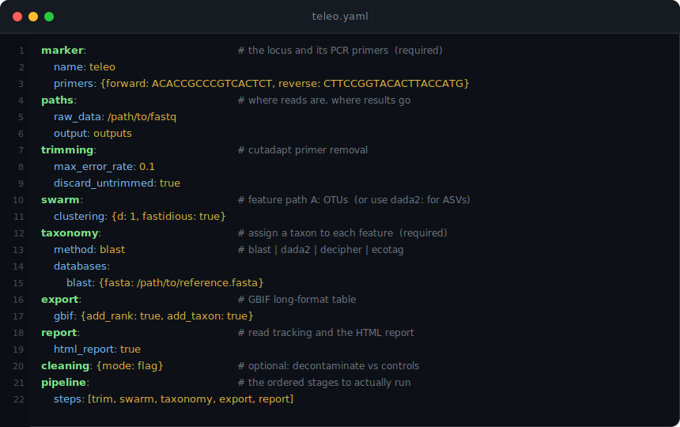

# Configuration Reference


Every key in a SeeDNAP marker config, with its type, default, and meaning. SeeDNAP uses one YAML file per marker to configure the whole pipeline. Your YAML is merged over the model defaults, so you specify only what differs. Complete working examples live in [config/markers/](../config/markers/).

A config at a glance, every top-level section in one view (the per-key reference for each follows below):

<p align="center">
  
</p>

## ⚙️ Generating and validating a config

`init` writes a config; `validate` checks it before you commit to a run.

```bash
seednap init --marker teleo --output config/markers/my_marker.yaml          # minimal: required fields only
seednap init --marker teleo --output config/markers/my_marker.yaml --full   # fully-annotated template

seednap validate config/markers/teleo.yaml
```

`init` writes a minimal config (just the required fields) by default; pass `--full` for the fully-annotated reference template. A standalone minimal example also lives at `config/markers/minimal.example.yaml`.

`validate` checks YAML syntax, field types, and required values, reports which `taxonomy.databases.<method>` block is used, and runs a preflight that fails with a non-zero exit if any referenced database or `raw_data` path is missing on disk. A config that loads but points at missing inputs is caught here, not mid-run.

All config models use strict validation (`extra="forbid"`), including inside the `taxonomy.databases.<method>` blocks. A typo in any field name is rejected at load time with a clear error, so you learn about a misspelled key from `seednap validate`, not hours into a run.

## ✅ Required keys

A minimal config must set exactly these (everything else has a default):

- `marker.name`
- `marker.primers.forward` and `marker.primers.reverse`
- `taxonomy.method`
- the required path(s) in the selected database block: `blast.fasta`; `dada2.all`; `ecotag.tree` and `fasta`; or `decipher.trained`

`paths.raw_data` has a schema default of `data/raw`, but a run effectively requires it to point at your FASTQ directory. Set it per dataset; the default is rarely correct.

## 🔀 Choosing a feature path and method block

`dada2` and `swarm` are the two mutually-exclusive feature (clustering) paths: the step that turns trimmed reads into the biological units you assign taxonomy to. Pick exactly one. Fill in only the section named in `pipeline.steps`. Likewise, under `taxonomy` fill only `databases.<method>` for your chosen `method`; the other method blocks are ignored.

| Path | Produces | Meaning |
| --- | --- | --- |
| `dada2` | ASVs | Amplicon sequence variants: denoised, exact sequences resolved to single-nucleotide differences |
| `swarm` | OTUs | Operational taxonomic units: sequences clustered together within a small edit distance |

You do not need to delete the unused `dada2`/`swarm` or `databases.<method>` blocks; whatever is not selected by `pipeline.steps` and `taxonomy.method` is simply not read.

## 🧩 How config merging works

Your YAML is merged over the model defaults: any field with a default may be omitted, and nested sections merge recursively. Lists and scalars are replaced wholesale, not appended. To change one entry of a list such as `pipeline.steps` or `taxonomy.contaminants`, restate the whole list.

## 📂 Output tree

`pipeline.steps` and `paths.output` determine where results land. The orchestrator creates this tree under `paths.output`:

| Path | Written by |
| --- | --- |
| `<output>/01_trim/<marker>/` | `trim` (and `demultiplex`, under `01_trim/<marker>/demux/`) |
| `<output>/02_dada2/<marker>/` | `dada2` feature path |
| `<output>/02_swarm/<marker>/` | `swarm` feature path |
| `<output>/03_taxo/<marker>/` | `taxonomy` |
| `<output>/04_report/<marker>/` | `report` (override with `report.output_dir`) |
| `<output>/<marker>_<method>.csv` | merged taxonomy + abundance table |
| `<output>/<marker>_<method>_cleaned.csv` | `clean` (the cleaned/annotated abundance table) |
| `<output>/<marker>_<method>_gbif.csv` | `export` (GBIF/DarwinCore table) |

For the merged table, `<method>` is the `taxonomy.method` value, except the DADA2 RDP classifier writes `<marker>_dada2RDP.csv` (the others are `<marker>_blast.csv`, `<marker>_ecotag.csv`, `<marker>_decipher.csv`).

<details>
<summary><b>Hidden state files: how a run is reconstructed</b></summary>

Two hidden files alongside the outputs record what was run, so any single run can be reconstructed and re-verified.

- `<output>/.<marker>_state.json` tracks every step's status, duration, error, and output paths, records the `seednap` version that ran the pipeline, and drives `--resume`.
- `<output>/.<marker>_config.snapshot.yaml` is the effective merged config (your YAML over the defaults) exactly as it was used, written into the output tree rather than relying on the original YAML being unchanged.

On `--resume`, a `seednap` version mismatch against the recorded version is logged as a `[WARN]`.

</details>

## 🏷️ `marker` (required)

```yaml
marker:
  name: "teleo"                         # marker name (lowercase)
  description: "Teleost fish 12S rRNA"  # optional
  primers:
    forward: "ACACCGCCCGTCACTCT"        # forward primer (5' to 3')
    reverse: "CTTCCGGTACACTTACCATG"     # reverse primer (5' to 3')
```

| Key | Type | Default | Meaning |
| --- | --- | --- | --- |
| `name` | str | required | Marker name, lowercase |
| `description` | str | none | Optional free-text description |
| `primers.forward` | str | required | Forward primer, 5' to 3' |
| `primers.reverse` | str | required | Reverse primer, 5' to 3' |

Primers are validated for IUPAC DNA bases (A C G T R Y M K S W H B V D N) and must be at least 10 bp.

## 📁 `paths`

```yaml
paths:
  raw_data: "/path/to/raw/fastq"   # input FASTQ directory
  output: "outputs"                # base output directory
  logs: "logs"                     # log files directory
```

| Key | Type | Default | Meaning |
| --- | --- | --- | --- |
| `raw_data` | path | `data/raw` | Input FASTQ directory (flat per-sample files, or per-library subfolders; see below) |
| `output` | path | `outputs` | Base output directory (see Output tree) |
| `logs` | path | `logs` | Log files directory |

Relative paths are resolved to absolute paths and `~` is expanded. The `output` and `logs` directories are created automatically when the config loads. Reference databases are not set here; each taxonomy method points at its own database under `taxonomy.databases.<method>`.

<details>
<summary><b>Layout of <code>raw_data</code>: flat files vs per-library subfolders</b></summary>

seednap looks for per-sample paired files named `<sample>_R1.fastq.gz` / `<sample>_R2.fastq.gz` (also accepts `.R1`/`.R2` and the `_001` suffix). They can sit directly in `raw_data`, or be organized into per-library / per-run subfolders: discovery scans the top level first and, if nothing is there, searches subdirectories recursively. So already-demultiplexed data kept one folder per sequencing library is processed without flattening it. Sample names must be unique across subfolders; a name that resolves to files in more than one subfolder is rejected as ambiguous rather than guessed.

</details>

## 🔖 `demultiplex`

Demultiplexing runs only if `demultiplex` is listed in `pipeline.steps` (before `trim`). For pre-demultiplexed inputs (one FASTQ pair per sample), omit it; there is no `enabled`/`skip` flag.

```yaml
demultiplex:
  protocol: "ligation"                  # "ligation", "standard", or "none"
  metadata: "/path/to/metadata.csv"     # required when the demultiplex step runs
  max_sample_failure_rate: 0.5          # abort if more than this fraction of samples fail
```

| Key | Type | Default | Meaning |
| --- | --- | --- | --- |
| `protocol` | "ligation" \| "standard" \| "none" | `none` | Demultiplexing protocol |
| `metadata` | path | none | Sample-tag metadata CSV; required when the step runs |
| `max_sample_failure_rate` | float (0.0-1.0) | `0.5` | Abort the step if more than this fraction of samples fail; otherwise log failures and continue |

> [!WARNING]
> Listing `demultiplex` in `pipeline.steps` with any protocol other than `ligation` (including the default `none` and the unimplemented `standard`) is rejected at config load, not mid-run. Only the `ligation` protocol is implemented. Either set `protocol: ligation`, or remove `demultiplex` from `pipeline.steps` if your reads are already demultiplexed.

The `ligation` protocol splits one multiplexed library FASTQ into per-sample files using a tag-to-sample mapping, then trims primers. It processes one bad sample at a time and only fails the whole library when the per-sample failure rate crosses `max_sample_failure_rate`. It requires `demultiplex.metadata`: a CSV whose header row contains exactly these columns:

| Column | Meaning |
| --- | --- |
| `eventID` | Sample/event identifier (the per-sample output name) |
| `tag_demultiplex` | The ligation tag sequence for that sample |
| `library` | Library identifier; matches the raw FASTQ filename prefix |

If `metadata` is unset when the step runs, the run raises a `ValueError` naming the fix.

<details>
<summary><b>Converting the lab's <code>Corr_tags</code> files into a metadata CSV</b></summary>

The lab's `Corr_tags` files cannot be used as-is. They are headerless and semicolon-delimited in the column order `well;library;sample;project;marker;tagseq`. Convert one to a headed metadata CSV first, mapping `eventID` <- `sample`, `tag_demultiplex` <- `tagseq`, and `library` <- `library`. A missing or misnamed column is reported with the columns it actually found.

</details>

## ✂️ `trimming`

```yaml
trimming:
  min_length: 20            # min read length after trimming (bp)
  max_error_rate: 0.1       # max error rate for primer matching
  cores: 1                  # CPU cores for cutadapt
  discard_untrimmed: true   # discard reads without detected primers
  overlap: 3                # min overlap for primer detection (bp)
```

| Key | Type | Default | Meaning |
| --- | --- | --- | --- |
| `min_length` | int (>= 1) | `20` | Minimum read length after trimming, bp |
| `max_error_rate` | float (0.0-1.0) | `0.1` | Maximum error rate for primer matching |
| `cores` | int (>= 1) | `1` | CPU cores for cutadapt (shipped marker configs raise this) |
| `discard_untrimmed` | bool | `true` | Discard reads with no detected primer |
| `overlap` | int (>= 1) | `3` | Minimum overlap for primer detection, bp |

## 🧬 `swarm`

The OTU feature path. Used only when `swarm` is in `pipeline.steps`. It merges paired reads, removes chimeras (artefactual sequences formed when two real templates fuse during PCR; they create spurious OTUs if not removed), then clusters with SWARM.

```yaml
swarm:
  merge:
    fastq_maxdiffs: 10      # max differences in overlap region
    fastq_minovlen: 10      # min overlap length for merging
    allow_stagger: false    # allow merging staggered reads
  clustering:
    d: 1                    # SWARM distance threshold
    fastidious: true        # refine singletons
    boundary: 3             # min mass for large OTUs (fastidious)
    threads: 4              # CPU threads
  chimera:
    method: "denovo"        # "denovo" or "none"
  min_sequence_length: 20   # min sequence length after merging
```

| Key | Type | Default | Meaning |
| --- | --- | --- | --- |
| `merge.fastq_maxdiffs` | int | `10` | Max differences in the overlap region |
| `merge.fastq_minovlen` | int | `10` | Min overlap length for merging |
| `merge.allow_stagger` | bool | `false` | Allow merging staggered reads |
| `clustering.d` | int | `1` | SWARM clustering distance threshold |
| `clustering.fastidious` | bool | `true` | Enable fastidious mode (refine singletons) |
| `clustering.boundary` | int | `3` | Min mass for large OTUs in fastidious mode |
| `clustering.threads` | int | `4` | CPU threads |
| `chimera.method` | "denovo" \| "none" | `denovo` | Chimera detection method |
| `min_sequence_length` | int | `20` | Min sequence length after merging |

## 🧬 `dada2`

The ASV feature path. Used only when `dada2` is in `pipeline.steps`.

```yaml
dada2:
  filter:
    max_ee: 2.0             # maximum expected errors
    trunc_q: 11             # truncate at first base with Q <= trunc_q
    max_n: 0                # max N bases allowed
    rm_phix: true           # remove PhiX reads
    min_len: null           # optional min read length
    max_len: null           # optional max read length
  merge:
    min_overlap: 20         # min overlap for merging (bp)
    max_mismatch: 0         # max mismatches in overlap
  chimera:
    method: "consensus"     # "consensus", "pooled", or "none"
  pool: false               # pool samples for denoising
  multithread: true         # use multithreading
  per_library: false        # learn a separate error model per library, then merge
  collect_metrics: true     # ASV summary stats -> metrics.json/csv + console
```

| Key | Type | Default | Meaning |
| --- | --- | --- | --- |
| `filter.max_ee` | float | `2.0` | Maximum expected errors |
| `filter.trunc_q` | int | `11` | Truncate reads at the first base with quality <= this |
| `filter.max_n` | int | `0` | Maximum number of N bases allowed |
| `filter.rm_phix` | bool | `true` | Remove PhiX reads |
| `filter.min_len` | int | none | Optional minimum read length |
| `filter.max_len` | int | none | Optional maximum read length |
| `merge.min_overlap` | int | `20` | Minimum overlap for merging, bp |
| `merge.max_mismatch` | int | `0` | Maximum mismatches in the overlap region |
| `chimera.method` | "consensus" \| "pooled" \| "none" | `consensus` | Chimera detection method |
| `pool` | bool | `false` | Pool samples for denoising |
| `multithread` | bool | `true` | Use multithreading |
| `per_library` | bool | `false` | Learn a separate error model per sequencing library, then merge and collapse (see below). `false` uses one pooled model |
| `collect_metrics` | bool | `true` | Write ASV summary stats to `metrics.json`/`csv` and console |

<details>
<summary><b><code>per_library</code>: where the library grouping comes from</b></summary>

`per_library: true` learns a separate error model per sequencing library, then merges and collapses. The sample-to-library grouping comes from the manifest `seq_run_id` (`report.sample_metadata` / `demultiplex.metadata`); when no metadata is configured it is derived automatically from the per-library subfolders of `raw_data`. `false` uses one pooled model. Use for multi-run datasets.

</details>

## 🔬 `taxonomy` (required)

```yaml
taxonomy:
  method: "blast"           # "blast", "dada2", "decipher", "ecotag"
  contaminants:             # default: [] (empty -> nothing flagged)
    - "Homo_sapiens"
    - "Bos_taurus"
  databases:
    blast:
      fasta: "/path/to/blast_db.fasta"
      # ...
```

| Key | Type | Default | Meaning |
| --- | --- | --- | --- |
| `method` | "blast" \| "dada2" \| "decipher" \| "ecotag" | required | Taxonomic assignment method |
| `contaminants` | list[str] | `[]` | Species to flag as candidate contaminants |
| `databases` | map | `{}` | Per-method database blocks (see below) |

`contaminants` are matched against the assigned `species` column in the post-processor; matching rows get `is_contaminant_candidate=True`. Rows are never deleted; downstream decides what to do with the flag. Use the underscore-separated CRABS format (for example `Homo_sapiens`). The default is empty, so omitting it flags nothing.

The 2025 CRABS reference DBs write the literal string `"NA"` where a rank is unknown. SeeDNAP normalizes `"NA"`/`""`/`"nan"` to a genuine missing rank, so no LCA resolver treats `"NA"` as a taxon; missing ranks surface as `Unassigned`.

### `databases.blast`

```yaml
databases:
  blast:
    fasta: "/path/to/blast_db.fasta"
    perc_identity: 80.0
    qcov_hsp_perc: 80.0
    evalue: 1.0e-25
    max_target_seqs: 5
    task: "megablast"
    threshold_species: 99.0
    threshold_genus: 96.0
    threshold_family: 90.0
    threshold_order: 80.0
    threshold_class: 70.0
    top_bitscore_pct: 10.0
    lca_pident_delta: 1.0
    lca_algorithm: "cascade"
    lca_pid: 90.0
    lca_diff: 1.0
```

| Key | Type | Default | Meaning |
| --- | --- | --- | --- |
| `fasta` | path | required | Reference FASTA database |
| `perc_identity` | float (0-100) | `80.0` | Minimum percent identity |
| `qcov_hsp_perc` | float (0-100) | `80.0` | Minimum query coverage per HSP |
| `evalue` | float (> 0) | `1e-25` | Maximum e-value |
| `max_target_seqs` | int (>= 1) | `5` | Maximum hits retained |
| `task` | "megablast" \| "blastn" \| "dc-megablast" \| "blastn-short" | `megablast` | blastn task. `megablast` for short, high-identity amplicons against curated DBs; `blastn` for divergent references; `dc-megablast` and `blastn-short` are also accepted |
| `threshold_species` | float (0-100) | `99.0` | Species-level identity threshold |
| `threshold_genus` | float (0-100) | `96.0` | Genus-level identity threshold |
| `threshold_family` | float (0-100) | `90.0` | Family-level identity threshold |
| `threshold_order` | float (0-100) | `80.0` | Order-level identity threshold |
| `threshold_class` | float (0-100) | `70.0` | Class-level identity threshold |
| `top_bitscore_pct` | float (0-100) | `10.0` | LCA bitscore band as percent of best hit; `0.0` = exact ties only |
| `lca_pident_delta` | float (0-100) | `1.0` | In-band hits must be within this many percent-identity points of the best; `0` disables |
| `lca_algorithm` | "cascade" \| "collapsed_taxonomy" \| "fishbase_tiered" | `cascade` | LCA resolver (see below) |
| `lca_pid` | float (0-100) | `90.0` | `collapsed_taxonomy` only: hard percent-identity floor |
| `lca_diff` | float (0-100) | `1.0` | `collapsed_taxonomy` only: identity-window width for collapsing disagreeing hits to their LCA |

When a query sequence has several near-equal BLAST hits, SeeDNAP resolves them with an LCA (lowest common ancestor): it reports the most specific rank on which the competing hits agree, rather than arbitrarily picking one. The `top_bitscore_pct` and `lca_pident_delta` values decide which hits are close enough to the best to enter that vote.

The `threshold_*` values then drive a per-rank cascade: if percent identity falls below the threshold for a rank, that rank and every finer rank are nulled, so the output never shows orphan ranks (a genus call with no supporting species, for example). See [taxonomy-methods.md](taxonomy-methods.md) for the algorithm rationale.

<details>
<summary><b>Choosing an <code>lca_algorithm</code> resolver</b></summary>

`lca_algorithm` selects the resolver:

- `cascade` (default) is the header-derived resolver and uses `top_bitscore_pct` + `lca_pident_delta` plus the per-rank `threshold_*` values.
- `collapsed_taxonomy` is the eDNAFlow/OceanOmics percent-identity-window collapse-to-LCA: header-based, offline, tuned by `lca_pid`/`lca_diff`, and it does not apply the `threshold_*` cascade.
- `fishbase_tiered` is not implemented and raises if selected.

</details>

### `databases.dada2`

```yaml
databases:
  dada2:
    all: "/path/to/dada2_all.fasta"        # RDP-format DB (required)
    species: "/path/to/dada2_species.fasta" # required (addSpecies is always run)
    bootstrap_threshold: 80
```

| Key | Type | Default | Meaning |
| --- | --- | --- | --- |
| `all` | path | required | RDP-format database with all ranks |
| `species` | path | required | Species-level exact-match DB (addSpecies is always run) |
| `bootstrap_threshold` | int (0-100) | `80` | Minimum RDP bootstrap percent for a rank to be retained (Wang 2007). The bootstrap is the classifier's own confidence in a rank call (the fraction of resampled runs that agree). Below this value the rank is nulled and all finer ranks cascade to null |

### `databases.ecotag`

```yaml
databases:
  ecotag:
    tree: "/path/to/taxonomy/"        # NCBI taxonomy tree dir (required)
    fasta: "/path/to/reference.fasta" # reference sequences (required)
```

| Key | Type | Default | Meaning |
| --- | --- | --- | --- |
| `tree` | path | required | NCBI taxonomy tree directory |
| `fasta` | path | required | Reference FASTA database |

### `databases.decipher`

```yaml
databases:
  decipher:
    trained: "/path/to/trained.rds"   # trained classifier (required)
    threshold: 60
    processors: 8
```

| Key | Type | Default | Meaning |
| --- | --- | --- | --- |
| `trained` | path | required | Trained DECIPHER RDS file |
| `threshold` | int (0-100) | `60` | Confidence threshold for assignment |
| `processors` | int (>= 1) | `8` | CPU cores |

## 📊 `export`

Runs only if `export` is listed in `pipeline.steps` (after `taxonomy`). Writes `<output>/<marker>_<method>_gbif.csv`: a long-format occurrence table in the DarwinCore vocabulary (the standard column terms GBIF, the Global Biodiversity Information Facility, uses for biodiversity records), one row per detected taxon per sample.

```yaml
export:
  gbif:                            # the `export` step (long-format table)
    add_rank: true                 # add taxonomic rank column
    add_taxon: true                # add lowest taxon column
  darwincore:                      # the `darwincore` step (DarwinCore occurrence file)
    summarise_pcr_replicates: false  # collapse PCR-replicate suffixes, summing reads per sample
    skip_enrichment: false           # skip NCBI/WoRMS kingdom/phylum enrichment (offline/faster)
```

| Key | Type | Default | Meaning |
| --- | --- | --- | --- |
| `gbif.add_rank` | bool | `true` | Add a taxonomic rank column |
| `gbif.add_taxon` | bool | `true` | Add a lowest-available-taxon column |
| `darwincore.summarise_pcr_replicates` | bool | `false` | Collapse PCR-replicate suffixes, summing reads per sample |
| `darwincore.skip_enrichment` | bool | `false` | Skip the NCBI/WoRMS higher-rank enrichment |

ASV summary stats are collected by the DADA2 step via `dada2.collect_metrics`. There is no separate `metrics` section.

<details>
<summary><b>The <code>darwincore</code> step: occurrence file, provenance, dropped-rows QA</b></summary>

The `darwincore` step builds the GBIF-ready DarwinCore occurrence file (one row per occurrence with `eventID`, coordinates, `scientificName`, a deterministic `occurrenceID`, `contamination_flag`). List `darwincore` after `export` in `pipeline.steps`; it joins the long-format table to `report.sample_metadata` + `report.project_metadata` (both required, checked at preflight) and, unless `skip_enrichment`, fills higher ranks from NCBI/WoRMS. Output: `<output>/<marker>_<method>_darwincore.csv`.

When run in-pipeline, the reference-database (`otu_db`) and chimera-removal (`chimera_check`) provenance are filled automatically from the run config, so they need not be re-entered in the project metadata; a differing project-metadata value is used only as a fallback and the disagreement is logged with a `[WARN]`. It also writes `<output>_dropped.csv`, listing every occurrence the control and non-target filters removed and why (for QA). (The same builder is also available afterwards as the `create-gbif` command, which takes those values from the project CSV.)

See [gbif-export.md](gbif-export.md) for the full export guide.

</details>

## 📝 `report`

Runs only if `report` is listed in `pipeline.steps`. It always writes the per-step read/sequence tracking table and step summary; `html_report` additionally builds the self-contained HTML report. See [reporting.md](reporting.md).

```yaml
report:
  html_report: true               # also build the HTML report
  output_dir: null                # null -> "<output>/04_report"
  warn_below_retention_pct: 30.0  # warn for samples below this % of raw reads
  warn_step_loss_pct: 70.0        # warn when a step drops more than this %
  sample_metadata: null           # per-sample (field) metadata CSV; optional
  project_metadata: null          # project metadata CSV; optional
```

| Key | Type | Default | Meaning |
| --- | --- | --- | --- |
| `html_report` | bool | `true` | Build the HTML report; `false` = tracking table only |
| `output_dir` | path | none | Base dir for report artifacts; `null` uses `<output>/04_report` |
| `warn_below_retention_pct` | float | `30.0` | Warn for samples whose final non-chimeric reads fall below this percent of raw reads |
| `warn_step_loss_pct` | float | `70.0` | Warn when a single step drops more than this percent of a sample's reads |
| `sample_metadata` | path | none | Per-sample field metadata CSV for the report's Dataset/provenance section |
| `project_metadata` | path | none | Project metadata CSV for the report's Dataset section |

A per-marker subdirectory is created inside `output_dir`, so `output_dir: /data/reports` for marker `teleo` writes to `/data/reports/teleo/`. `~` is expanded and relative paths are resolved.

## 🧼 `cleaning`

Control decontamination of the abundance table: removing or flagging sequences that turn up in your negative controls (blanks) so they are not reported as real detections. A negative control (blank) is a no-template reaction carried alongside the samples to reveal contamination introduced during extraction or PCR; anything that appears in it is suspect.

Runs only if `clean` is listed in `pipeline.steps` (after a feature step). Cleaning is presence-based and works at the OTU/ASV level: any OTU/ASV (the per-sequence cluster the feature step produces) that carries reads in an applicable control is removed from, or flagged in, the associated samples. Counts are never altered in `flag` mode.

```yaml
cleaning:
  mode: "flag"    # "flag" or "subtract"
```

| Key | Type | Default | Meaning |
| --- | --- | --- | --- |
| `mode` | "flag" \| "subtract" | `flag` | `flag` adds a boolean `in_negative_control` column marking control-positive OTUs/ASVs without changing counts; `subtract` zeroes those reads in the associated samples |

Control identity (which columns are negative controls, whether each is an extraction or a PCR blank, and which extraction batch it belongs to) comes from a FAIRe manifest. In a pipeline run that manifest is built from `report.sample_metadata` (the per-sample field metadata CSV). If `report.sample_metadata` is unset, the `clean` step is skipped with a `[WARN]` and export uses the uncleaned table. A control column present in the table but absent from the manifest is classified by its name and warned about.

> [!WARNING]
> `mode: subtract` alters the abundance table, so it is opt-in. An extraction blank (taken through DNA extraction with its batch) cleans only the samples sharing its `extraction_ID`; a PCR blank (added at the amplification step) cleans the whole dataset. `mode: flag` is non-destructive (it only annotates). Both modes write a per-sample report (`reads_before`/`reads_after`, OTUs and reads removed, and the controls that drove each removal).

Cleaning can also be run standalone: `seednap clean ABUNDANCE_CSV FIELD_METADATA OUTPUT --mode flag|subtract`, where `FIELD_METADATA` is the per-sample field metadata CSV.

## 🔧 `logging`

```yaml
logging:
  level: "INFO"        # "DEBUG", "INFO", "WARNING", "ERROR"
  format: "detailed"   # "simple", "detailed", "json"
  file: true           # write to log file
  console: true        # write to console
```

| Key | Type | Default | Meaning |
| --- | --- | --- | --- |
| `level` | "DEBUG" \| "INFO" \| "WARNING" \| "ERROR" | `INFO` | Logging level |
| `format` | "simple" \| "detailed" \| "json" | `detailed` | Log format |
| `file` | bool | `true` | Write logs to file |
| `console` | bool | `true` | Write logs to console |

## 🚀 `pipeline`

```yaml
pipeline:
  steps:
    - "trim"
    - "swarm"      # or "dada2" (mutually exclusive)
    - "taxonomy"
    - "report"
```

| Key | Type | Default | Meaning |
| --- | --- | --- | --- |
| `steps` | list[str] | `["trim", "dada2", "taxonomy", "export", "report"]` | Ordered list of stages to run |

`pipeline.steps` is the single source of truth for what runs and in what order: a stage runs only if it is listed, and each stage reads its own section for parameters (defaults if the section is omitted). Valid stages: `demultiplex` (before `trim`), `trim`, `dada2` | `swarm` (mutually exclusive feature paths), `taxonomy`, `clean` (after a feature step), `export` (after `taxonomy`), `report`.

> [!WARNING]
> The order is validated against these dependencies at load time. An invalid order (for example `taxonomy` before `dada2`) is rejected with a message naming the fix.

## 📦 Example configs

Complete working examples in [config/markers/](../config/markers/):

| File | Marker | Method | Notes |
| --- | --- | --- | --- |
| `teleo.yaml` | Teleo 12S fish (Namibia) | BLAST | SWARM path; ligation `demultiplex` block is configured but not listed in `pipeline.steps`, so demux does not run as shipped |
| `mifish.yaml` | MiFish-U 12S fish | BLAST | SWARM path |
| `mam07.yaml` | MamP007 16S mammal (Greina) | BLAST | SWARM path |
| `mam07_dada2.yaml` | MamP007 16S mammal | DADA2 | DADA2 ASV path |
| `teleo_rhone.yaml` | Teleo 12S fish (Rhone) | BLAST | SWARM path |
| `minimal.example.yaml` | minimal template | -- | required fields only |

## 📖 See also

| Guide | What's inside |
| --- | --- |
| [cli-reference.md](cli-reference.md) | CLI commands and flags |
| [pipeline-steps.md](pipeline-steps.md) | What each stage does |
| [taxonomy-methods.md](taxonomy-methods.md) | LCA algorithms and threshold rationale |
| [reporting.md](reporting.md) | The report step and HTML output |
| [gbif-export.md](gbif-export.md) | GBIF/DarwinCore export |
</content>
</invoke>
