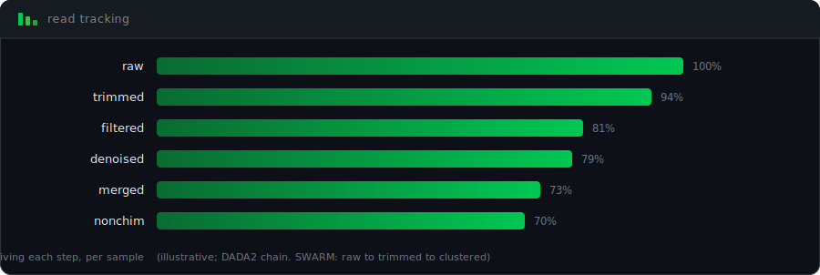
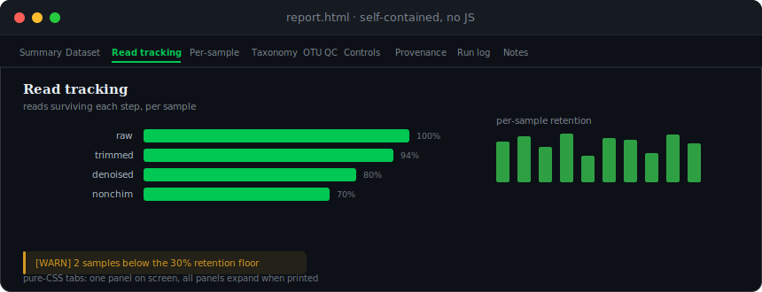

# Run Reporting


How SeeDNAP records what happened in a run: the read-tracking table, the step summary, and the HTML run report.

Every `report` step writes a per-sample read/sequence tracking table and a run-level step summary, and (by default) a self-contained HTML report. Read this when you want to audit data loss, share results, or regenerate a report from a finished run.

## 🟢 When reporting runs

The `report` step runs when `report` is listed in `pipeline.steps` (it is in the default steps, so it runs unless you remove it). When it runs it always writes `read_tracking.csv` + `.txt` and `step_summary.csv`; set `report.html_report: false` to skip only the HTML document. To skip reporting entirely, omit `report` from `pipeline.steps`.

Reporting only reads artifacts the pipeline already produced. It never alters the run, and a reporting failure is logged as `[WARN]` and never fails the pipeline.

The read-tracking table keys off the feature path that produced the abundance table, so the report step needs a completed `dada2` or `swarm` step in the same run. If neither has completed, the step is skipped with a `[WARN]` (it is not an error).

Note that `report.html_report` has no effect unless `report` is in `pipeline.steps`: the run loop only dispatches stages that are listed, so when `report` is absent the report step never runs and `html_report` is never read. The HTML toggle is checked only inside the report step, after the read-tracking table has been written.

## 📂 Artifacts

| Artifact | File | Always written |
|---|---|---|
| Read/sequence tracking table | `read_tracking.csv` + `read_tracking.txt` | Yes (when `report` runs) |
| Run-level step summary | `step_summary.csv` | Yes (when `report` runs) |
| HTML run report | `report.html` | Only when `html_report` is on (or `--html`) |

By default these go to `<paths.output>/04_report/<marker>/`. Set `report.output_dir` to redirect them (a per-marker subdirectory is created inside it).

## 📊 Read-tracking table

The table records per-sample read counts at each stage. The stages depend on the feature-generation path. SWARM produces OTUs (operational taxonomic units: sequences clustered by similarity); DADA2 produces ASVs (amplicon sequence variants: exact sequences resolved by an error model, no similarity clustering):

- **SWARM:** `raw -> trimmed -> clustered`
- **DADA2:** `raw -> trimmed -> filtered -> denoised -> merged -> nonchim`

For DADA2, `denoised` is reads after the error model corrects sequencing errors, `merged` is forward/reverse reads joined into one amplicon, and `nonchim` is reads left after chimeras (artefactual sequences formed when two real templates join during PCR) are removed.

<p align="center">
  
</p>

| Source | Counts |
|---|---|
| Cutadapt logs (`logs/<sample>_trim_pass{1,2}.txt`) | `raw` (pass-1 read pairs processed), `trimmed` (pass-2 pairs written) |
| DADA2 `track_reads.csv` (`02_dada2/<marker>/`) | `filtered`, `denoised`, `merged`, `nonchim` |
| SWARM `otu_table.csv` (`02_swarm/<marker>/`) | `clustered` (per-sample column sums) |

A `pct_retained` column gives the fraction of raw reads surviving to the final stage.

**No silent zeros.** A count that cannot be measured (a missing log, a sample absent from the DADA2 track) is recorded as `NA` with a `[WARN]`, never a misleading `0`. A genuine `0` (e.g. a control filtered to nothing) is `0`.

### Data-loss warnings

Two thresholds drive warnings, written to the run log and shown in the HTML report's Read-tracking section:

| Key | Default | Range | Meaning |
|---|---|---|---|
| `warn_below_retention_pct` | `30.0` | 0-100 | Warn when a sample's final reads fall below this percent of its raw reads. |
| `warn_step_loss_pct` | `70.0` | 0-100 | Warn when a single step drops more than this percent of a sample's reads. |

Both are validated at config load; a value outside 0-100 errors before the run starts.

## 📈 Step summary (`step_summary.csv`)

A compact run-level table, one row per step, with two columns:

- `total_reads`: total reads/read-pairs across all samples after that step (the sum of the per-sample tracking counts).
- `n_features`: the number of features after that step, i.e. ASVs for the DADA2 path (at `merged` and `nonchim`) and OTUs for SWARM (at `clustered`). Features first exist once a sequence/OTU table is built, so the read-level steps (`raw`/`trimmed`/`filtered`/`denoised`) carry no feature count.

This is the "reads and ASVs/OTUs lost at each step" table commonly reported in eDNA metabarcoding papers. The ASV counts come from a `feature_counts.csv` the DADA2 R step writes (`ncol` of the merged and non-chimeric sequence tables); the OTU count is the number of rows in the SWARM `otu_table.csv`. If a step is measured for some samples but not others, `total_reads` is the sum over the measured samples and a `[WARN]` names the unmeasured ones. The same table is shown in the HTML report's Read-tracking tab.

## 🔬 HTML run report

A single self-contained `.html` file (no external assets, no CDN, no JavaScript; charts are embedded as base64 PNGs) styled like a typeset scientific paper. A sticky top navigation bar carries one button per section; clicking a button shows that panel (pure-CSS tabs: one panel visible at a time on screen, all panels expanded when printed).

<p align="center">
  
</p>

Seven sections are always present; three are conditional on their input data being available:

| # | Section | Contents | Condition |
|---|---|---|---|
| 1 | Summary | Run descriptor, abstract, run-summary table | Always |
| 2 | Dataset | Identity and provenance (see below) | Always |
| 3 | Read tracking | Read funnel, per-sample retention figures, full table, data-loss warnings | Always |
| 4 | Per-sample detail | Reads retained, features detected (richness), retention per sample | Always |
| 5 | Taxonomic assignment | Assignment rate per rank, best-hit identity distribution, detected species, top genera | Only if a taxonomy table is present |
| 6 | OTU / feature QC | Chimera classification and sequence-length distribution | Only on the SWARM path (full OTU table present) |
| 7 | Controls & contamination | Features detected in negative controls | Always |
| 8 | Run provenance | Per-step status and duration from the run state JSON | Only if state steps are present |
| 9 | Run log | Complete console transcript, colorized by level | Always (shows an explanatory note if no run log was resolved) |
| 10 | Notes & methods | Definitions and the thresholds used | Always |

The numbering above is the maximum (at-most-ten) layout. The Taxonomic-assignment, OTU/feature-QC, and Run-provenance tabs appear only when their inputs exist, so the tab set and its numbering vary between runs. (The Run-log tab is always present; when no log is resolved it shows an explanatory note instead of a transcript.)

A few terms used in these sections: *richness* is the number of distinct features (ASVs or OTUs) detected in a sample; *best-hit identity* is the BLAST percent identity of a feature's top reference match (higher means a closer match to a known sequence); *occupancy* is the number of biological samples a species was detected in. A feature with no usable taxonomy is reported as `Unassigned` and is never counted as a real taxon.

Figures use a publication style (Computer Modern serif via matplotlib, a restrained grey + single sea-green accent palette). For runs with more than 50 samples, the per-sample bar charts (retention and richness) become distribution histograms instead, since one bar per sample would be unreadably tall; the tables still list every sample.

> [!WARNING]
> `matplotlib` is a required runtime dependency (a normal `pip install` always pulls it). If a custom or minimal install lacks it, figure rendering fails: the report still renders with text and tables but no charts, and emits a `[WARN]`. Do not treat matplotlib as optional.

<details>
<summary><b>Run-log section</b></summary>

Its own tab renders the pipeline's full console transcript (`logs/<marker>_pipeline_run.log`) inside a styled terminal window with a Fullscreen button (pure CSS, no JavaScript). It is colorized by log level with `rich`'s own HTML export so the styling matches the live console (on a dark background: `INFO` blue, `WARNING` amber, `ERROR` red). Short logs are shown whole; long ones are truncated to keep the file portable, but every `WARNING`/`ERROR` line is always kept along with the run's start/end, and intervening runs of routine lines are replaced by explicit `... N omitted ...` markers (never a silent drop). The on-disk path to the complete log is printed alongside it.

In an orchestrator run the log is wired automatically. For the standalone `report` command it is auto-located under `logs/` (or supplied with `--log-file`). If no log is found, the section says so explicitly.

</details>

<details>
<summary><b>Dataset &amp; provenance section</b></summary>

So scientists can tell what the dataset is and where/when it was collected, the report summarizes provenance from three sources:

- **Pipeline config** (always present in an orchestrator run): dataset name, marker, primers, raw-data path, reference DB.
- **Field metadata CSV** (optional, `report.sample_metadata`): sampling location (lat/lon centroid + range), distinct sites, site names / basin / ecosystem / water body / environment, sampling-date range, depth, institution, laboratory. Negative controls (blanks: samples that should contain no biological DNA, used to detect contamination) are excluded from the geography. Controls are recognized by the lab naming conventions in the manifest (`Blank*`, `CNEG`/`CEXT`/`CMET`/`CPCR`, `EXT_NC`/`PCR_NC`, `water*`), not a literal `Blank` prefix alone.
- **Project metadata CSV** (optional, `report.project_metadata`): recorder, sequencing method, reference DB, assignment method.

If no field/project metadata is provided, the section says so explicitly rather than omitting it silently.

When `report.sample_metadata` is set, the run cross-checks the manifest derived from that field metadata against the abundance table's sample columns. This check runs immediately after the feature step (DADA2 or SWARM) completes, not at report time; an eventID set mismatch (e.g. an unlabelled `Blank-PCR-3` column) emits a `[WARN]`. The check is warn-only and never alters or fails the run.

</details>

## ⚙️ Configuration

Reporting runs when `report` is in `pipeline.steps`. Its parameters live in the `report:` block in the marker YAML.

```yaml
report:
  html_report: true                # also write report.html (default: true; false = tables only)
  output_dir: null                 # base dir for artifacts; null -> "<paths.output>/04_report"
  warn_below_retention_pct: 30.0   # per-sample retention floor (raw -> final), 0-100
  warn_step_loss_pct: 70.0         # single-step loss ceiling, 0-100
  # Optional dataset metadata for the Dataset/provenance section:
  # sample_metadata: "/path/to/metadata_field_<dataset>.csv"
  # project_metadata: "/path/to/metadata_proj_<dataset>.csv"
```

| Key | Type | Default | Meaning |
|---|---|---|---|
| `html_report` | bool | `true` | Generate the self-contained HTML run report. `false` writes the tables only. |
| `output_dir` | path \| null | `null` | Base directory for artifacts; a per-marker subdirectory is created inside it. `null` resolves to `<paths.output>/04_report`. |
| `warn_below_retention_pct` | float (0-100) | `30.0` | Per-sample retention warning floor. |
| `warn_step_loss_pct` | float (0-100) | `70.0` | Single-step loss warning ceiling. |
| `sample_metadata` | path \| null | `null` | Per-sample (field) metadata CSV for the Dataset/provenance section. |
| `project_metadata` | path \| null | `null` | Project metadata CSV for the Dataset section. |

The block and all its fields are optional; defaults apply with both the tables and the HTML report on. The config model is strict (`extra="forbid"`), so a typo errors at load time. `~` is expanded and relative paths are resolved at load time.

Note that the config key is `sample_metadata`, but the standalone `report` command's flag for the same input is `--field-metadata`. Likewise `project_metadata` maps to `--project-metadata`. The YAML key and the CLI flag names differ for the field metadata.

## ⌨️ CLI

The report can be regenerated from existing outputs at any time.

```bash
# Read-tracking table + step summary only
seednap report teleo -o outputs

# Full HTML report with dataset provenance
seednap report teleo -o outputs --html \
  --field-metadata metadata/metadata_field_my_dataset.csv \
  --project-metadata metadata/metadata_proj_my_dataset.csv
```

| Option | Default | Description |
|---|---|---|
| `-o, --output-dir PATH` | `outputs` | Base output directory of the run |
| `--html` | off | Also generate the self-contained HTML report |
| `--warn-retention FLOAT` | `30.0` | Per-sample retention warning threshold (%) |
| `--warn-step-loss FLOAT` | `70.0` | Single-step loss warning threshold (%) |
| `--field-metadata PATH` | auto | Field metadata CSV (location, dates, sites) |
| `--project-metadata PATH` | auto | Project metadata CSV (recorder, sequencing, DB) |
| `--log-file PATH` | auto | Run log to embed in the HTML report's Run-log section |

If `--field-metadata` / `--project-metadata` are omitted, the command auto-locates `metadata_field_<marker>.csv` / `metadata_proj_<marker>.csv` inside the output directory (`<output>/` or its `<output>/metadata/` subfolder) and warns if none is found.

The standalone `report` command loads no YAML config, so it always writes to `<-o>/04_report/<marker>/` and does not honor `report.output_dir`. Only the in-pipeline `report` step honors `report.output_dir`.

During `run-pipeline`, the `report` step writes the read-tracking table, step summary, and (unless disabled with `html_report: false`) the HTML report together, after the rest of the pipeline has run, so the taxonomy and provenance sections are populated.

## 📂 Outputs

```text
<paths.output>/04_report/<marker>/
  read_tracking.csv      # per-sample counts at each step + % retained
  read_tracking.txt      # human-readable aligned table
  step_summary.csv       # run-level: total reads + ASV/OTU count after each step
  report.html            # self-contained HTML report (only with html_report / --html)
  cleaning_report.csv    # only when the clean step ran; co-located here
```

The `clean` step writes `cleaning_report.csv` into this same per-marker report directory. It is a decontamination artifact, not a reporting artifact, but it lands alongside the reporting files.

## 📖 See also

- [Pipeline steps](pipeline-steps.md) for the report step's place in the run and decontamination details.
- [Configuration reference](configuration.md) for the full `report:` block and `pipeline.steps`.
- [CLI reference](cli-reference.md) for the `report` command.
