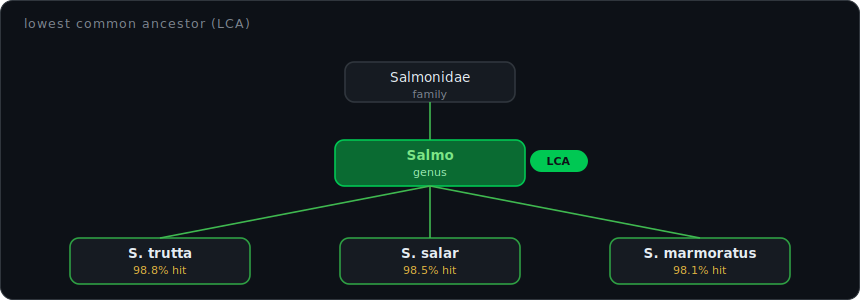
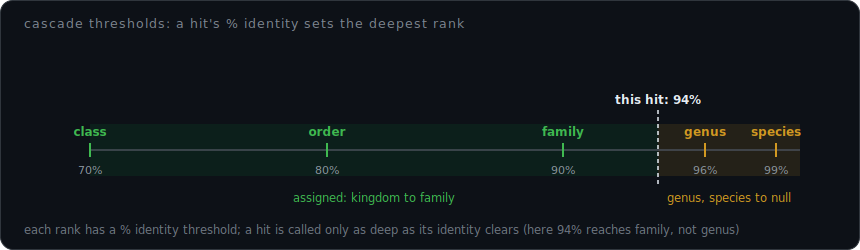

# Taxonomic Assignment Methods

How SeeDNAP assigns taxonomy to the representative sequences produced by clustering, with one section per supported method.


## 🧬 What gets a taxon

The input to this stage is one representative DNA sequence per detected variant: an **ASV** (Amplicon Sequence Variant, an exact denoised sequence from the DADA2 path) or an **OTU** (Operational Taxonomic Unit, a cluster of near-identical sequences from the SWARM path). This doc uses "OTU" loosely to mean either. Each carries a per-sample abundance (read count). The taxonomy stage attaches a Linnaean lineage (kingdom through species) to each one.

SeeDNAP supports four taxonomic assignment methods, selected via the `taxonomy.method` field in the YAML config. The sections below cover each method's algorithm, reference database format, and configuration keys. For per-key config tables across the whole pipeline see [configuration.md](configuration.md).

The taxonomy stage runs only if `taxonomy` appears in `pipeline.steps` (a stage runs iff listed). Setting `taxonomy.method` alone does not trigger it. When it runs, it writes the final merged taxonomy+abundance table to `<paths.output>/<marker>_<method>.csv` and, if `export` is also listed, the GBIF table to `<paths.output>/<marker>_<method>_gbif.csv`.

All four methods produce the same output schema: identical column names, identical null/cascade semantics, and an `is_contaminant_candidate` column in the same position. Downstream tooling never branches on the method.

## 📊 Method comparison

| Method | Algorithm | Speed | Best For |
|---|---|---|---|
| **BLAST + LCA** | Local alignment + Lowest Common Ancestor | Moderate | Custom databases, configurable thresholds |
| **DADA2 RDP** | Naive Bayesian classifier | Fast | Standard workflows, DADA2 format databases |
| **DECIPHER** | IdTaxa machine learning classifier | Fast | Pre-trained models, confidence scores |
| **ecotag** | OBITools global alignment | Slow | Legacy OBITools workflows |

The `<method>` token in output filenames is the `taxonomy.method` value, with one exception: the DADA2 path writes `<marker>_dada2RDP.csv`, not `<marker>_dada2.csv`. The other methods use `blast`, `decipher`, or `ecotag` directly.

**Lowest Common Ancestor (LCA)** is the recurring idea behind every method here. When a sequence matches several references that disagree on, say, which species but agree on the genus, the assignment is reported only as deep as the references actually agree: the disagreed rank and all finer ranks are set to null. This avoids guessing a single species when the data only support a genus, and it is why a finer rank can be blank while a coarser one is filled.

<p align="center">
  
</p>

## 🔬 BLAST + LCA (recommended)

The default method. `makeblastdb` builds a nucleotide database from the reference FASTA (if not already present), then each query is searched with `blastn`, taxonomy is parsed from the reference headers, and a per-rank cascade plus a top-bitscore LCA decide how deep each call is reported.

The BLASTn search command:

```
blastn -query {query} -db {db}
  -task {task}
  -outfmt "6 qseqid sseqid pident length mismatch gapopen
           qstart qend sstart send evalue bitscore"
  -perc_identity {perc_identity}
  -qcov_hsp_perc {qcov_hsp_perc}
  -evalue {evalue}
  -max_target_seqs {max_target_seqs}
```

Four search knobs gate which raw hits BLAST returns:

| Key | Effect | Default |
|---|---|---|
| `perc_identity` | Minimum percent identity for a hit to be reported. Absolute floor on the raw blastn alignment; distinct from the per-rank `threshold_*` cascade below. | `80.0` |
| `qcov_hsp_perc` | Minimum query coverage per HSP. Hits aligning less than this fraction of the query are dropped. | `80.0` |
| `evalue` | Maximum e-value; larger (less significant) hits are discarded. | `1e-25` |
| `max_target_seqs` | Maximum number of database hits kept per query. | `5` |
| `task` | blastn algorithm; see the task table below. | `megablast` |

The `task` field accepts four values:

| Value | Word size / use |
|---|---|
| `megablast` (default) | Word size 28; for short, high-identity vertebrate amplicons against curated references. |
| `blastn` | Word size 11; for divergent references where the family/order tier of hits matters. |
| `dc-megablast` | Discontiguous megablast; tolerant of substitutions, for cross-species comparisons. |
| `blastn-short` | Tuned for very short queries (under ~30 bp). |

### Cascade-null per-rank filtering

Each of the five ranks class through species has a percent-identity threshold. When a hit's percent identity is below the threshold for a rank, that rank **and every finer rank** are set to null. (Kingdom and phylum have no threshold; they pass through on any hit that cleared the absolute `perc_identity` cutoff.) The output therefore never contains orphan ranks like `kingdom=Metazoa, phylum=None, class=Mammalia`.

| Rank | Default |
|---|---|
| `threshold_species` | 99.0 |
| `threshold_genus` | 96.0 |
| `threshold_family` | 90.0 |
| `threshold_order` | 80.0 |
| `threshold_class` | 70.0 |

<p align="center">
  
</p>

Each is also settable on the `blast` and `assign-taxonomy` CLI commands via the matching `--threshold-<rank>` flag, with the same default.

`perc_identity` and the `threshold_*` values are two different identity controls. `perc_identity` is the absolute blastn cutoff that decides which raw hits exist at all; the `threshold_*` cascade decides which ranks of an accepted hit survive. A hit can clear `perc_identity` (80%) yet still be nulled below the species level (99%). The default thresholds follow Pappalardo et al. 2025 (*Methods in Ecology and Evolution* 16:2380-2394), with rRNA-marker tweaks (family raised vs eDNAFlow).

### MEGAN-LR top-bitscore LCA

When an OTU has several good hits, the resolver decides how deep to call it. It pools all hits whose *bitscore* (BLAST's alignment-quality score; higher is a better match) is within `top_bitscore_pct` (default 10 percent) of the best hit's bitscore, rather than requiring exact ties, which are brittle when references are near-duplicates. An in-band identity floor `lca_pident_delta` (default 1.0 percent-identity points below the best in the pool) keeps a single near-identity off-target hit from dragging the whole pool down. Ranks on which the pooled hits disagree are nulled (this is the LCA step). Setting `top_bitscore_pct: 0` reverts to exact-tie behavior.

### Output merging and contamination flagging

Taxonomy is **left-joined** onto the OTU/ASV abundance table so that OTUs without any BLAST hit surface as `Unassigned` rows rather than being silently dropped.

If `taxonomy.contaminants` is set, every row whose `species` matches one of the listed names gets `is_contaminant_candidate=True`. Rows are **never** deleted; the flag propagates through the GBIF formatter into the DarwinCore output as `contamination_flag` for downstream review. (DarwinCore is the GBIF biodiversity-record standard SeeDNAP exports to; see the export docs.) The default is an empty list, so omitting `contaminants` flags nothing.

This is name-based flagging of usual-suspect taxa (human, livestock, pets; see Whitmore et al. 2023), not blank/negative-control decontamination. Removing OTUs that also appear in extraction or PCR blanks (laboratory no-template controls run to catch reagent and cross-sample contamination) is a separate `clean` pipeline step, documented elsewhere.

The merged final table is written to `<paths.output>/<marker>_blast.csv`. The intermediate BLAST TSV and other per-method artifacts live under `<paths.output>/03_taxo/<marker>/`.

### Reference database format

The reference FASTA must have tab-separated headers with semicolon-delimited taxonomy:

```
>KY213962	Metazoa;Chordata;Actinopteri;NA;Centropomidae;Lates;Lates_calcarifer
CACCGCGGTTATACGAGAGGCCCAAGCTGAC...
```

At least 7 semicolon-separated ranks are required: kingdom, phylum, class, order, family, genus, species. Only the first 7 are consumed; any extra ranks are silently ignored. Use `NA` for unknown ranks.

> [!WARNING]
> Build the BLAST database with `makeblastdb` from the **exact same** reference FASTA you pass to seednap. If a BLAST hit references a sequence ID that has no lineage among the parsed FASTA headers, the parser hard-fails with a descriptive error. This guards against the known silent-zero failure class: a mismatched DB and FASTA would otherwise produce empty assignments that look valid.

The parser also hard-fails on a header with too few tab fields (no taxonomy after the ID) or fewer than 7 semicolon ranks. It does not reject headers with more than 7 ranks.

Databases built with [CRABS](https://github.com/gjeunen/reference_database_creator) (Jeunen et al., 2023) are compatible out of the box. The 2025 CRABS reference DBs write the literal string `NA` where a rank is unknown. SeeDNAP normalizes `NA` (and `""`/`nan`) to a genuine missing rank at the BLAST formatter, in one place, so **neither** LCA resolver treats `NA` as a real taxon: no over-collapse onto a phantom shared rank, and no literal `NA` leaking into the export. Missing ranks surface as `Unassigned`.

### Configuration

```yaml
taxonomy:
  method: "blast"
  contaminants:                            # default: [] (flags nothing)
    - "Homo_sapiens"
    - "Bos_taurus"
  databases:
    blast:
      fasta: "/path/to/reference.fasta"    # REQUIRED
      perc_identity: 80.0                   # (default: 80.0) absolute blastn cutoff
      qcov_hsp_perc: 80.0                   # (default: 80.0) min query coverage per HSP
      evalue: 1.0e-25                       # (default: 1.0e-25) max e-value
      max_target_seqs: 5                    # (default: 5) max hits per query
      task: "megablast"                     # (default: "megablast")
      threshold_species: 99.0               # (default: 99.0)
      threshold_genus: 96.0                 # (default: 96.0)
      threshold_family: 90.0                # (default: 90.0)
      threshold_order: 80.0                 # (default: 80.0)
      threshold_class: 70.0                 # (default: 70.0)
      top_bitscore_pct: 10.0                # (default: 10.0) LCA bitscore band
      lca_pident_delta: 1.0                 # (default: 1.0) in-band %id floor below best
```

Only the `databases.<method>` block for the selected method is read; the others are ignored. You do not need to fill in `databases.dada2` when `method: "blast"`.

<details>
<summary><b>Alternative LCA resolver: collapsed-taxonomy (eDNAFlow/OceanOmics)</b></summary>

`lca_algorithm` selects the LCA resolver. The default is `cascade` (the per-rank threshold and top-bitscore steps above). An alternative is `collapsed_taxonomy`, the percent-identity-window collapse used by eDNAFlow and OceanOmics.

`collapsed_taxonomy` works as follows:

1. Discard every hit below `lca_pid` (default 90.0), a hard percent-identity floor.
2. Among survivors, take the best percent identity and keep all hits within `lca_diff` (default 1.0) identity points of it (the "identity window").
3. Collapse the windowed lineages to their Lowest Common Ancestor: ranks on which they disagree are nulled, and every finer rank cascades to null.

| | `cascade` (default) | `collapsed_taxonomy` |
|---|---|---|
| Identity controls | Per-rank `threshold_*` (species 99 / genus 96 / family 90 / order 80 / class 70) | `lca_pid` floor + `lca_diff` window only; `threshold_*` ignored |
| Hit pooling | `top_bitscore_pct` band + `lca_pident_delta` | `lca_diff` identity window |
| Low identity | Nulls below per-rank thresholds | More permissive: a 90-96% hit can still resolve to its windowed LCA |
| Disagreement | Resolved by per-rank threshold | More conservative: any disagreement in the window collapses to the LCA |
| Lineage source | Header-based, offline | Header-based, offline |

Both resolvers are **header-based**: the lineage comes from the CRABS reference FASTA headers, needing no NCBI taxids and no `taxdump`. Query coverage is enforced the same way for both, at the `blastn` step via `qcov_hsp_perc`.

`lca_algorithm: fishbase_tiered` is accepted by the schema but not implemented; selecting it raises `NotImplementedError` at run time.

```yaml
taxonomy:
  method: "blast"
  databases:
    blast:
      fasta: "/path/to/reference.fasta"    # REQUIRED
      lca_algorithm: "collapsed_taxonomy"   # (default: "cascade")
      lca_pid: 90.0                         # (default: 90.0) hard %identity floor
      lca_diff: 1.0                         # (default: 1.0) identity-window width
```

</details>

## ⚙️ DADA2 RDP classifier

Uses the naive Bayesian classifier from DADA2 (Wang et al., 2007; Callahan et al., 2016). Requires R and the `dada2` Bioconductor package.

The classifier runs in two stages. First, `assignTaxonomy` assigns kingdom through genus and returns a per-rank *bootstrap* confidence (0-100; a bootstrap is the fraction of resampled subsets of the read's k-mers that still vote for the same taxon, so it measures how stable the call is). Then `addSpecies` adds the species rank by exact match (100 percent identity), which is not bootstrap-based.

The `bootstrap_threshold` (default 80, the Wang 2007 recommendation for short rRNA reads) is applied to kingdom through genus: a rank whose bootstrap falls below the threshold is nulled, and every finer rank cascades to null (so the output never carries an orphan rank like `class=Mammalia` under a nulled `phylum`). Two deliberate exceptions match the legacy pipeline:

- Species itself is never bootstrap-gated; it is kept whenever `addSpecies` found an exact match.
- An exact species match overrides the bootstrap for the whole lineage: a read with a confident 100 percent species hit but a low genus bootstrap keeps its genus and coarser ranks rather than being nulled.

The `pident` column reported for the DADA2 path is `bootstrap_min`, the lowest bootstrap across the kingdom-to-genus ranks actually kept (species is exact-match), giving a per-sequence confidence summary analogous to BLAST's percent identity.

### Configuration

```yaml
taxonomy:
  method: "dada2"
  contaminants:
    - "Homo_sapiens"
  databases:
    dada2:
      all: "/path/to/dada2_all.fasta"       # REQUIRED, ranks kingdom..genus
      species: "/path/to/dada2_species.fasta"  # REQUIRED for the dada2 method; the step errors without it
      bootstrap_threshold: 80               # (default: 80)
```

DADA2 RDP works on both DADA2 ASVs and SWARM OTUs; the runner accepts the query FASTA explicitly and does not require a `seqtab_clean.rds` from the DADA2 step. The merged final table is written to `<paths.output>/<marker>_dada2RDP.csv`.

## 🔧 DECIPHER IdTaxa

Uses the DECIPHER IdTaxa classifier (Murali et al., 2018). Requires a pre-trained `.rds` classifier file and the R `DECIPHER` package.

| Key | Type | Default | Meaning |
|---|---|---|---|
| `trained` | Path | REQUIRED | Path to the trained DECIPHER `.rds` classifier. |
| `threshold` | int | 60 | Confidence (0-100) required for assignment. Lower values assign more sequences with less certainty. |
| `processors` | int | 8 | Number of CPU cores IdTaxa uses. |

```yaml
taxonomy:
  method: "decipher"
  databases:
    decipher:
      trained: "/path/to/trained_classifier.rds"  # REQUIRED
      threshold: 60                         # (default: 60)
      processors: 8                         # (default: 8)
```

The merged final table is written to `<paths.output>/<marker>_decipher.csv`.

## 🧪 ecotag (OBITools)

Uses the ecotag algorithm from OBITools (Boyer et al., 2016). Requires an NCBI-format taxonomy tree and a reference sequence database.

> [!WARNING]
> ecotag requires OBITools v1, which has Python 2 dependencies and lives in its own conda env. The runner auto-discovers the binary in this order: (1) the active `PATH` (an activated obitools env wins when `ecotag`, `obiannotate`, and `obitab` all resolve there); (2) the `SEEDNAP_OBITOOLS_BIN` environment variable; (3) a set of well-known install paths. `PATH` takes precedence over the env var, not the other way around. No manual `conda activate obitools` is needed when running through seednap. Setup details: [ecotag-setup.md](ecotag-setup.md).

| Key | Type | Default | Meaning |
|---|---|---|---|
| `tree` | Path | REQUIRED | Path to the NCBI taxonomy tree directory. |
| `fasta` | Path | REQUIRED | Path to the reference FASTA database. |

```yaml
taxonomy:
  method: "ecotag"
  databases:
    ecotag:
      tree: "/path/to/ncbi/taxonomy/"       # REQUIRED, NCBI taxonomy tree directory
      fasta: "/path/to/reference.fasta"     # REQUIRED, reference FASTA database
```

The merged final table is written to `<paths.output>/<marker>_ecotag.csv`.

## 📖 See also

- [configuration.md](configuration.md) - full config key reference for every section.
- [pipeline-steps.md](pipeline-steps.md) - where the taxonomy step sits in the pipeline.
- [ecotag-setup.md](ecotag-setup.md) - installing the OBITools v1 environment.

<details>
<summary><b>References</b></summary>

- Boyer, F. et al. (2016). obitools: a unix-inspired software package for DNA metabarcoding. *Molecular Ecology Resources*, 16, 176-182.
- Callahan, B.J. et al. (2016). DADA2: High-resolution sample inference from Illumina amplicon data. *Nature Methods*, 13, 581-583.
- Camacho, C. et al. (2009). BLAST+: architecture and applications. *BMC Bioinformatics*, 10, 421.
- Huson, D.H. et al. (2018). MEGAN-LR: new algorithms allow accurate binning and easy interactive exploration of metagenomic long reads and contigs. *Biology Direct*, 13, 6.
- Jeunen, G.J. et al. (2023). crabs - A software program to generate curated reference databases. *Molecular Ecology Resources*, 23, 725-738.
- Murali, A., Bhargava, A. & Wright, E.S. (2018). IDTAXA: a novel approach for accurate taxonomic classification of microbiome sequences. *Microbiome*, 6, 140.
- Pappalardo, P. et al. (2025). A field-standard set of identity thresholds for eDNA metabarcoding taxonomic assignment. *Methods in Ecology and Evolution*, 16, 2380-2394.
- Wang, Q. et al. (2007). Naive Bayesian classifier for rapid assignment of rRNA sequences. *Applied and Environmental Microbiology*, 73, 5261-5267.
- Whitmore, K. et al. (2023). Sources of contamination in environmental DNA studies. *Nature Ecology and Evolution*, 7, 1-3.

</details>
